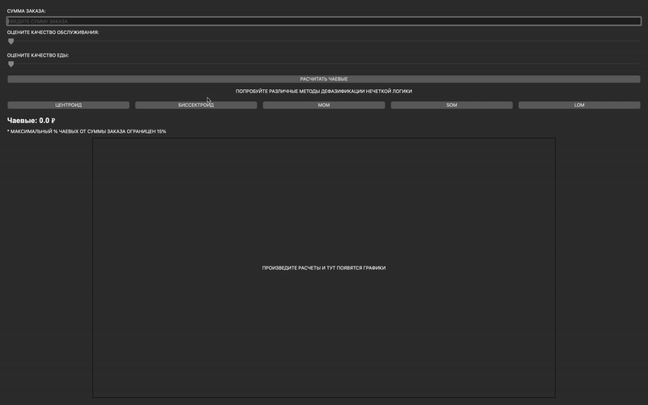

# Fuzzy Tip Calculator


Это программа для расчета чаевых с использованием методов нечеткой логики. Пользователи могут ввести сумму заказа и оценить качество обслуживания и еды, после чего программа вычислит чаевые с учетом выбранных методов дефазификации. Программа использует библиотеку **PyQt6** для интерфейса и **skfuzzy** для вычислений нечеткой логики.

## Функции

- Ввод суммы заказа, качества обслуживания и еды.
- Расчет чаевых с использованием нечеткой логики.
- Выбор метода дефазификации: Центроид, Биссектор, MOM, SOM, LOM.
- Отображение результатов и графиков.

## Установка

Для запуска программы нужно установить все необходимые библиотеки, указанные ниже.

### Требования

1. **Python 3.x** (рекомендуется версия 3.6 и выше).
2. Необходимые библиотеки:

    - `PyQt6` - для графического интерфейса.
    - `skfuzzy` - для вычислений с нечеткой логикой.
    - `matplotlib` - для визуализации графиков.

### Установка зависимостей

1. Клонируйте репозиторий:

    ```bash
    git clone https://github.com/yourusername/fuzzy-tip-calculator.git
    ```

2. Перейдите в директорию проекта:

    ```bash
    cd fuzzy-tip-calculator
    ```

3. Установите необходимые библиотеки:

    Если у вас установлен **pip**, используйте следующую команду:

    ```bash
    pip install -r requirements.txt
    ```

    Если файл `requirements.txt` еще не был создан, вы можете установить библиотеки вручную:

    ```bash
    pip install PyQt6 skfuzzy matplotlib
    ```

## Запуск программы

После установки всех зависимостей вы можете запустить программу, выполнив команду:

```bash
python app.py
